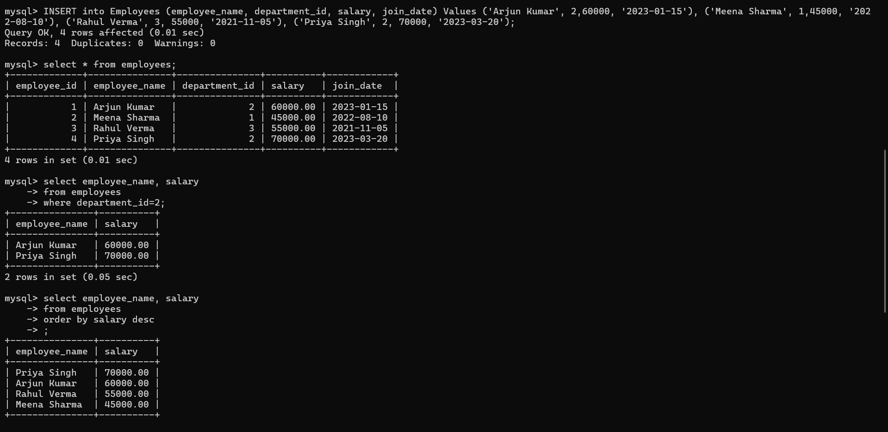
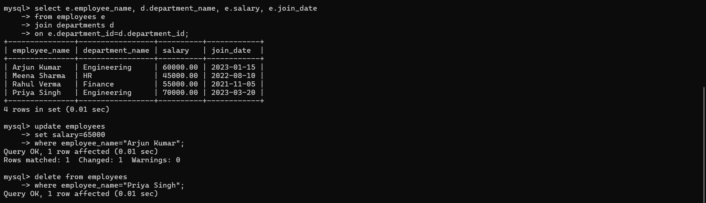

# Employee-Management-Database
SQL project for managing employee data with CRUD operations

# Employee Management Database
This project demonstrates a basic Employee Management Database using SQL. It includes table creation, data insertion, filtering, sorting, updating, and deleting records.

Technologies Used
- MySQL Command Line Client

Features
- Database & table creation
- CRUD operations (INSERT, UPDATE, DELETE)
- SELECT with WHERE and ORDER BY
- Basic table normalization

 Execution Screenshots
1. Database & Table Creation

2. Data Insertion & SELECT Query

3. Update & Delete Operations

